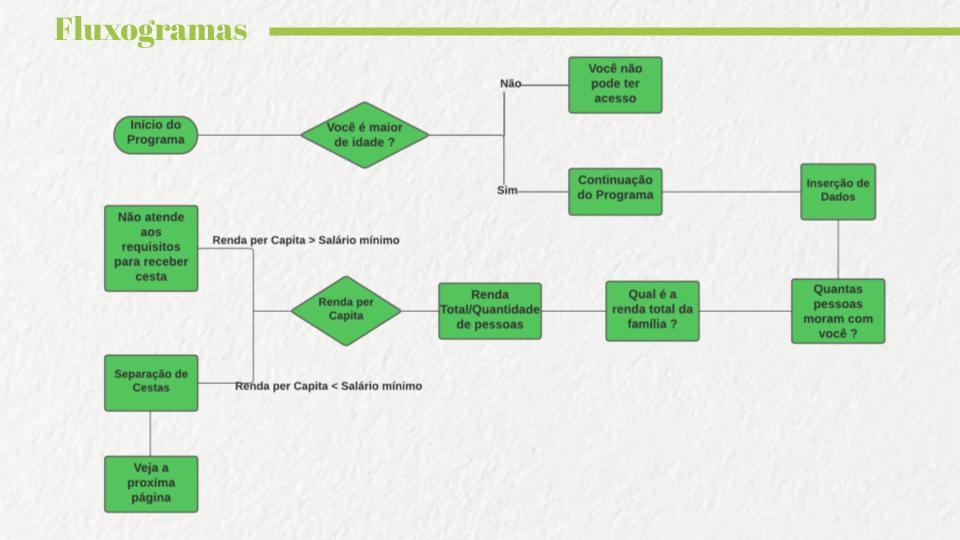

# Projeto Bloco 01 Java - [Generation Brazil](https://brazil.generation.org/)

## 6ª Família - Projeto Integrador Turma 49 - 2022

### O que é?

O 6ª Família é um programa idealizado e desenvolvido para auxiliar uma ONG que realiza a distribuição de alimentos para famílias em vulnerabilidade social. A cesta é adequada para a necessidade de cada família, quantidade de membros, e se algum membro tem algum tipo de restrição alimentar. 

### Fluxograma:

### Integrantes do Projeto:

[Alexandre Barbosa](https://github.com/alebs10) 
[Daniel Gardeli](https://github.com/gardeli96) 
[Gustavo Henrique Marques de Souza](https://github.com/guhms1998) 
[Leticia Alves Zuniga](https://github.com/LeZuniga) 
[Mateus Nogueira](https://github.com/nogran) 
[Tainã Xavier](https://github.com/taaixsp) 
